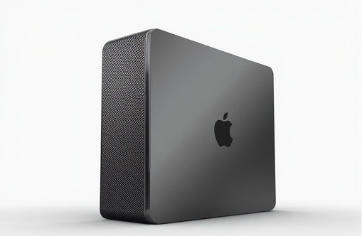
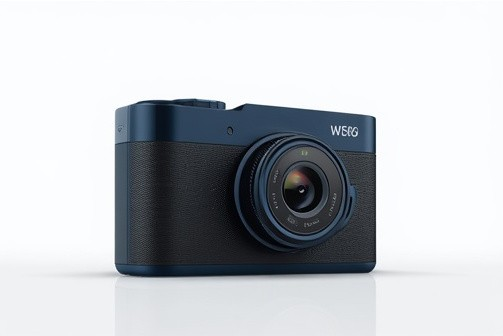
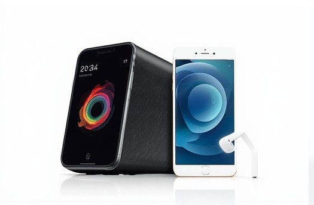
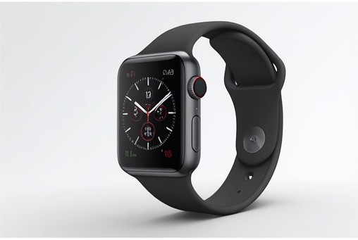

# Formas Raras

A responsive gallery of NFT collectibles and digital art. The project features six original pieces in an interface inspired by Frontend Mentor's [NFT Preview Card Component](https://www.frontendmentor.io/challenges/nft-preview-card-component-SbdUL_w0U) challenge.

## Links

- **Live site:** [bandolocortes-ux.github.io/Portifolio-GCSI](https://bandolocortes-ux.github.io/Portifolio-GCSI/)
- **Repository:** [github.com/bandolocortes-ux/Portifolio-GCSI](https://github.com/bandolocortes-ux/Portifolio-GCSI)

## Screenshots

## Technologies

- HTML5, CSS3, and vanilla JavaScript
- [Animate.css](https://animate.style/) for card entrance animations
- GitHub Pages for hosting

## Collection

The vector artworks were created for this project. Each card displays the artwork title, artist, edition, and a fictional ETH price. Cards respond to hover and touch, include favorite controls, and adapt to mobile, tablet, and desktop screens.

| Sol de bolso | Jardim elétrico | Maré lunar |
|:---:|:---:|:---:|
|  |  |  |

| Quase domingo | Ponto de fuga | Nuvem baixa |
|:---:|:---:|:---:|
|  |  |  |

## Visual References

- [OpenSea](https://opensea.io/) and [Foundation](https://foundation.app/) as digital collectible gallery references
- [Frontend Mentor — NFT Preview Card Component](https://www.frontendmentor.io/challenges/nft-preview-card-component-SbdUL_w0U) as the original challenge

## Author

Created by [@bandolocortes-ux](https://github.com/bandolocortes-ux).