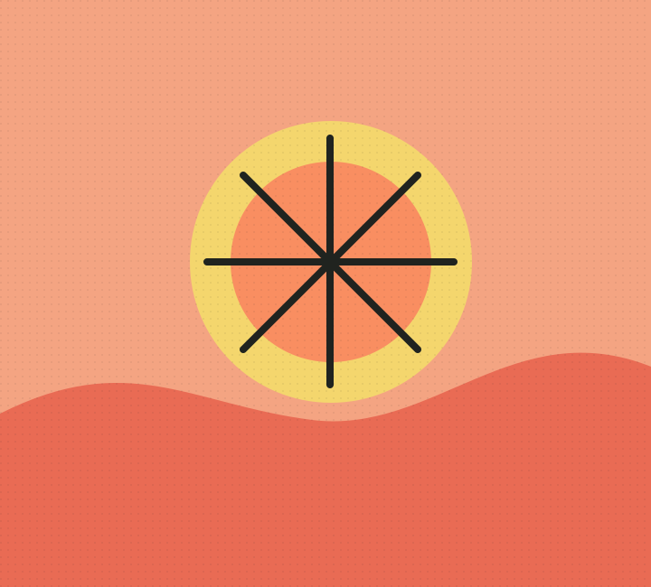
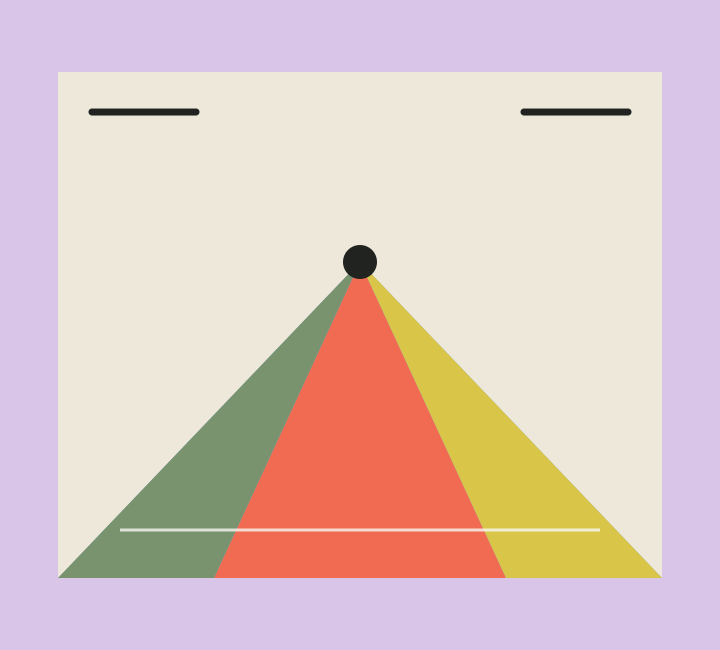

# Formas Raras

Galeria responsiva de colecionáveis NFT e arte digital. O projeto reúne seis peças originais em uma interface inspirada no desafio [NFT Preview Card Component](https://www.frontendmentor.io/challenges/nft-preview-card-component-SbdUL_w0U).

## Acesso

- **Site:** [bandolocortes-ux.github.io/Portifolio-GCSI](https://bandolocortes-ux.github.io/Portifolio-GCSI/)
- **Repositório:** [github.com/bandolocortes-ux/Portifolio-GCSI](https://github.com/bandolocortes-ux/Portifolio-GCSI)

## Tecnologias

- HTML5, CSS3 e JavaScript sem framework
- [Animate.css](https://animate.style/) para a entrada animada dos cards
- GitHub Pages para hospedagem

## Coleção

As artes vetoriais foram criadas para este projeto e acompanham cards com nome, artista, edição e valor fictício em ETH. Os cards têm movimento no hover e controles de favoritos; o layout se adapta a celular, tablet e desktop.

| Sol de bolso | Jardim elétrico | Maré lunar |
|:---:|:---:|:---:|
|  |  |  |

| Quase domingo | Ponto de fuga | Nuvem baixa |
|:---:|:---:|:---:|
|  |  |  |

## Referências visuais

- [OpenSea](https://opensea.io/) e [Foundation](https://foundation.app/) como referências de galerias de colecionáveis digitais
- [Frontend Mentor — NFT Preview Card Component](https://www.frontendmentor.io/challenges/nft-preview-card-component-SbdUL_w0U) como ponto de partida do desafio

## Autoria

Desenvolvido por [@bandolocortes-ux](https://github.com/bandolocortes-ux).